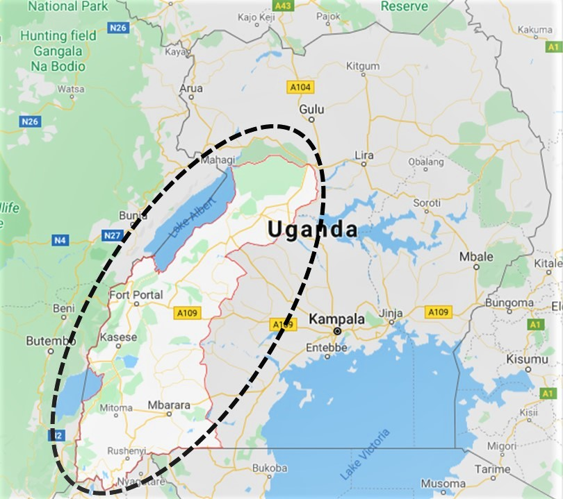

<style>
body {
text-align: justify}
</style>


```{r setup, include=FALSE, message=FALSE}
knitr::opts_chunk$set(echo = TRUE)
library(readr)
library(dplyr)
library(tidyr)
library(broom)
library(ggplot2)
library(incidence)
library(conflicted)

conflict_prefer('filter', 'dplyr')
conflict_prefer('select', 'dplyr')
```


```{r echo=FALSE, message=FALSE}
ebola_dat <- read_csv(file = '../data/ebola_1_update.csv') %>% 
    arrange(reportDate) %>% 
  mutate(reportDelay = reportDate - onsetDate) 

ebola_dat_outbreak1 <- ebola_dat %>% filter(reportDate < reportDate[3])
ebola_dat_outbreak2 <- ebola_dat %>% filter(reportDate > reportDate[2])

```
```{r echo=FALSE, message=FALSE, warning=FALSE}

## overall calculations for report
first_reporting_date <- pull(ebola_dat, reportDate)[1]
last_reporting_date <- pull(ebola_dat, reportDate)[nrow(ebola_dat)]
total_confirmed <- as.numeric(table(ebola_dat$status)['confirmed'])
total_probable <- as.numeric(table(ebola_dat$status)['probable'])
total_deaths <- sum(!is.na(ebola_dat$deathDate))
```

```{r echo=FALSE, message=FALSE, warning=FALSE}
total_confirmed_female <- ebola_dat %>% 
  filter(status == 'confirmed', sex == 'female') %>%
  count()
#cases by sex

case_status_by_sex <- ebola_dat %>% 
    filter(status == 'confirmed') %>% 
    group_by(status, sex) %>% 
    count() 

##outbreak 1
total_confirmed_outbreak1 <- as.numeric(table(ebola_dat_outbreak1$status)['confirmed'])
total_probable_outbreak1  <- as.numeric(table(ebola_dat_outbreak1$status)['probable'])
total_suspected_outbreak1  <- as.numeric(table(ebola_dat_outbreak1$status)['suspected'])

##outbreak 2
total_confirmed_outbreak2 <- as.numeric(table(ebola_dat_outbreak2$status)['confirmed'])
total_probable_outbreak2  <- as.numeric(table(ebola_dat_outbreak2$status)['probable'])
total_suspected_outbreak2  <- as.numeric(table(ebola_dat_outbreak2$status)['suspected'])
n_deaths_outbreak2 <- sum(!is.na(ebola_dat_outbreak2$deathDate))
```
```{r echo=FALSE, message=FALSE, warning=FALSE}
#case fatality ratio
#reportDelay_mean <- mean(ebola_dat_update$reportDelay)

fatality_confirmed_cases <- ebola_dat %>% 
    filter(status == 'confirmed') %>% 
    drop_na(deathDate) %>% 
    nrow()

fatality_confirmed_cases_sex <- ebola_dat %>% 
    filter(status == 'confirmed') %>% 
    drop_na(deathDate) %>% 
    group_by(sex) %>% 
    count()

cfr <- binom.test(fatality_confirmed_cases, total_confirmed, conf.level = .95) %>% 
    tidy(cfr) %>% 
    select(conf.low, estimate, conf.high)

cfr_female <- binom.test(as.numeric(fatality_confirmed_cases_sex)[2], as.numeric(total_confirmed_female), conf.level = .95) %>% 
    tidy() %>% 
    select(conf.low, estimate, conf.high)
```

```{r echo=FALSE, message=FALSE, warning=FALSE}
## create the incidence object from the data
ebola_inc_outbreak2 <- incidence(ebola_dat_outbreak2$onsetDate, groups = ebola_dat_outbreak2$status)


## exponential fit to determine peak
sex.incidence <- incidence(ebola_dat_outbreak2$onsetDate, interval=7, groups = ebola_dat_outbreak2$sex)

fit.sex <- fit(sex.incidence)

exponential_fit_plot <- plot(sex.incidence, fit= fit.sex)


## Estimating R0

library(R0)

outbreak2_inc_byday <- incidence(ebola_dat_outbreak2$onsetDate, interval=1)

outbreak2_inc_byday_plot <- plot(outbreak2_inc_byday)

mGT <- generation.time("gamma", c(12, 5.2))

## primary estimate using exponential growth method (end time = 25 (as indicated by model split))

R0_exponential_growth <- est.R0.EG(as.numeric(outbreak2_inc_byday$counts), mGT, begin = 1, end = 25)

```

**Date of issue:** `r format(Sys.Date(),' %d-%m-%Y')`

**Data as reported by:** `r format(last_reporting_date, ' %d-%m-%Y')`

## Context
A community in the Southwestern part of Uganda is currently experiencing an outbreak of the Ebola virus Disease (EVD). Uganda is a country in the east of Africa. The South Western part of Uganda, highlighted in the black dashed region in the map below, shares a border to the west with the Democratic Republic of Congo, and a border to the south with Rwanda. In particular, this region is in proximity to Beni and Butembo, two areas experiencing high numbers of EVD cases weekly. 

The community has a population of 452 people. Nothing is known about the exact geographic location, and the age and sex distribution of the population.

```{r, echo=FALSE, fig.align="center", fig.cap = "Map of Uganda (source: Googlemaps). The Southwestern region is indicated in the black dashed region.", out.width = '100%'}

```

## Highlights
### First outbreak 
- From `r ebola_dat_outbreak1$reportDate[1]` to `r ebola_dat_outbreak1$reportDate[2]`, one probable and confirmed case were reported in the community but this outbreak did not take off.
- No deaths were reported from this outbreak.

### Second outbreak
- On `r ebola_dat_outbreak2$reportDate[3]`, a second outbreak was reported. 
- As of `r last_reporting_date`, a total of `r nrow(ebola_dat)` EVD cases, including `r total_confirmed` confirmed and `r total_probable` probable cases have been reported in Uganda.
- Of the total confirmed, `r case_status_by_sex[1, 3]` are female and `r case_status_by_sex[2, 3]` are male.


### Figure 2: Disease status of reported cases for the second outbreak by date of onset.
```{r echo=FALSE, message=FALSE}
plot(ebola_inc_outbreak2, xlab = 'Date of onset') + labs(fill = 'Status')
```
 
### Case fatality
 - As of `r last_reporting_date`,  there have been `r fatality_confirmed_cases` deaths among the confirmed cases. The case-fatality ratio among the confirmed cases is `r round(cfr$estimate*100, 1)`% (95% CI, `r round(cfr$conf.low *100, 1)`% to `r round(cfr$conf.high *100, 1)`%). 
- There has been no fatality among male confirmed cases. The case fatality ratio among females is `r round(cfr_female$estimate*100, 1)`%, (95% CI, `r  round(cfr_female$conf.low*100, 1)`% to `r  round(cfr_female$conf.high*100, 1)`% ). 
- The high case fatality ratio among females compared to the males seems to be in agreement with the EVD outbreak in the Democratic Republic of Congo.
- We suspect the case-fatality ratios are under-estimates of the actual rate due to the number of unknown future deaths of cases ceteris paribus. Our future estimates will account for this bias by taking into account the delay between case onset and death date.

## Modelling

### Estimating the epidemic trajectory
We used the incidence package in R to fit an exponential model to the latest reported data on the second outbreak to estimate the peak of the epidemic. We determined that the peak occured on the Nov 11, 2019. After the peak the outbreak appears to be stable. 

We also performed a sub-group analysis (male versus female) by fitting a model for the sub-group specific epidemic after the peak. We found that there appears to be a decreasing trend in the number of cases in males but the number of cases is stable among females. However, this should be interpreted with caution due to the delay in reporting the cases and the small number of observed cases in the sub-groups. 

The figure below shows the fitting results of the sub-group model.

### Figure 3: Sub-group (male vs female) exponent fit after the peak of the second outbreak.
```{r echo=FALSE, message=FALSE}
plot(exponential_fit_plot)
```

### Transmissibility
We estimated the R0 to be `r round(R0_exponential_growth$R, 1)` (95% CI, `r round(R0_exponential_growth$conf.int[1], 1)` to `r round(R0_exponential_growth$conf.int[2], 1)`) using the R0 package in R. This means that on average an infected person infected up to `r round(R0_exponential_growth$R, 1)` other people by Nov 11, 2019. 

To estimate R0, we used the optimal splitting time point for determining the epidemic peak from the model fit in the previous section. We also assumed a Gamma distributed generation time for the cases with a mean of 12 days and a standard deviation of 5.2, obtained from Chowell et al, 2014.

## Conclusion
There were two separate outbreaks in Southwestern Uganda in 2019. The first outbreak resulted in one confirmed and probable case. The human-to-human transmission was not sustained. To the best of our knowledge, no interventions were reported and it is unclear what might have caused this break in transmission.

A second outbreak occured later in the 2019. The index case might have been imported from the neighboring towns to the West and most probably the communities around Beni and Butembo in the DRC. 

The outbreak appears to have reached a stable state. This might be due to the small size of the community and the interventions that were put in place. 

Our estimate of R0 indicates that each infected case may have been infecting `r round(R0_exponential_growth$R, 1)` other people towards to the peak of the epidemic. 

The high number of deaths among female confirmed cases compared to males agrees with outbreaks from elsewhere. 

More targetted interventions towards reducing the number of future cases especially among females might help reduce the fatalities resulting from EVD.  


